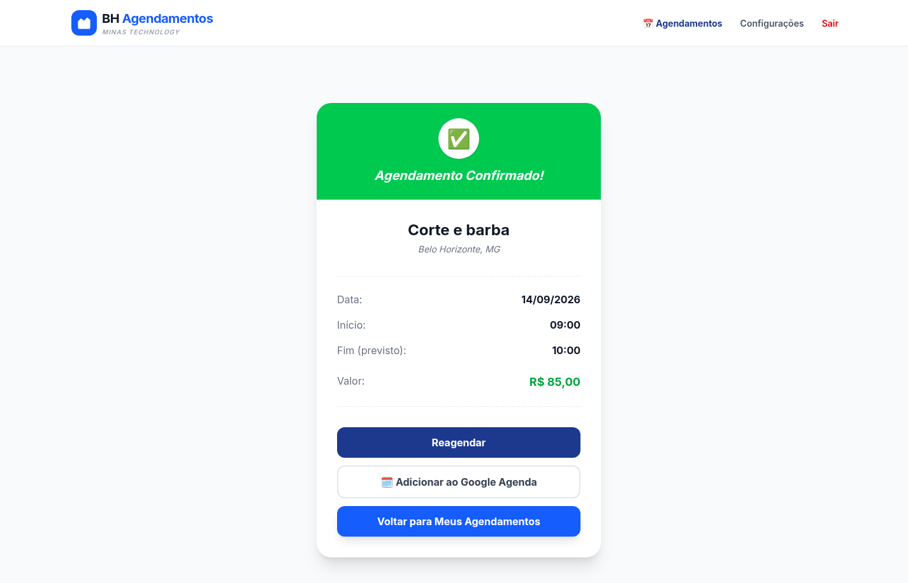
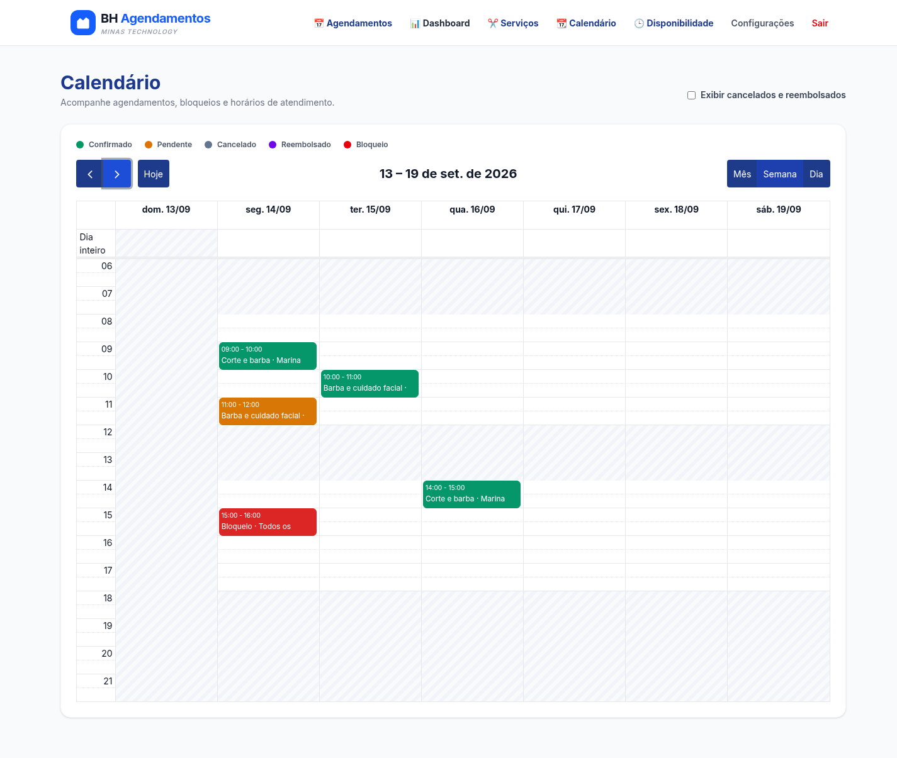
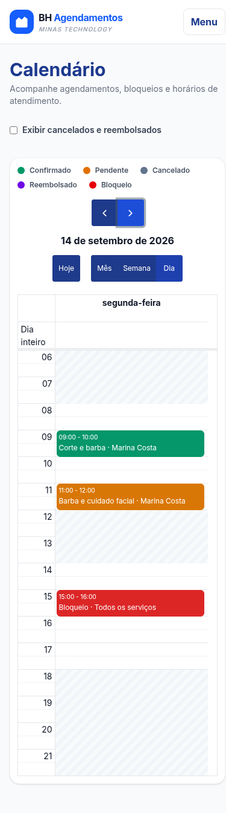
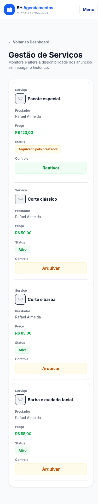
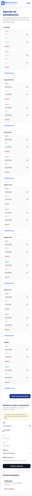
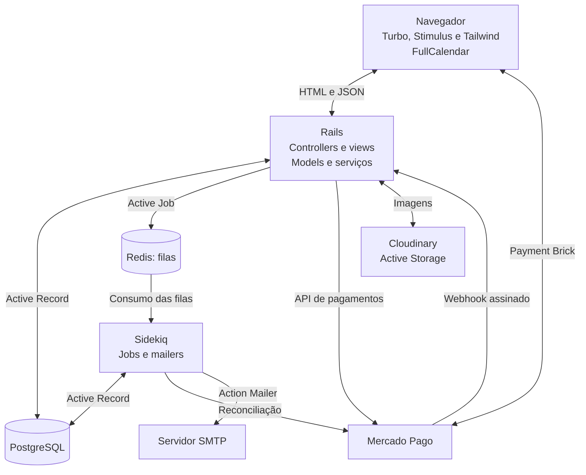

# 💈 BH Agendamentos

Marketplace de serviços e agendamentos para profissionais independentes e negócios locais de Belo Horizonte. Clientes encontram serviços por nome e bairro, reservam horários e acompanham pagamentos. Prestadores organizam a agenda e os atendimentos; administradores moderam usuários e serviços.

Aplicação Ruby on Rails com PostgreSQL, interface responsiva, pagamentos Mercado Pago e processamento em segundo plano com Sidekiq.

**[Acessar a demonstração](https://bh-agendamentos.onrender.com/)** · [Execução local](#execução-local) · [Dados de demonstração](#dados-de-demonstração) · [Testes](#qualidade-e-testes) · [Roadmap](TODO.md)

## Demonstração online

O ambiente de portfólio está publicado no Render, com integração financeira em sandbox. Utilize somente contas e instrumentos de pagamento de teste.

A carga `demo:seed` prepara exemplos para os três perfis, com senhas privadas e fotos fictícias. Sua execução no Render é uma etapa manual após disponibilizar o código e configurar as variáveis; o deploy não popula a demonstração automaticamente. O [roteiro de demonstração](docs/demo.md) reúne os acessos iniciais e as instruções.

Expirações programadas, lembretes de atendimento, manutenção e e-mails enfileirados dependem de um processo Sidekiq ativo no ambiente hospedado.

## Capturas de tela

Telas reais da aplicação, capturadas com dados fictícios no ambiente de teste. Clique nas imagens para abrir em tamanho original. As janelas usam 1440 × 900 px no desktop e 390 × 900 px no mobile; as capturas incluem a página inteira.

### Desktop

**Vitrine:** busca de serviços e filtro por bairro, com preço e acesso ao agendamento.

[](docs/screenshots/desktop-vitrine.png)

<details>
<summary>Agendamento confirmado e calendário semanal do prestador</summary>

**Cliente:** detalhes da reserva confirmada, valor pago e ação de reagendamento.

[](docs/screenshots/desktop-agendamento.png)

**Prestador:** agenda semanal com atendimentos confirmados, reserva pendente e bloqueio de horário.

[](docs/screenshots/desktop-calendario.png)

</details>

### Mobile

O calendário inicia na visão diária e a administração apresenta os serviços em cartões.

<table>
  <tr><th>Calendário diário</th><th>Administração de serviços</th></tr>
  <tr>
    <td valign="top"><a href="docs/screenshots/mobile-calendario.png"></a></td>
    <td valign="top"><a href="docs/screenshots/mobile-administracao.png"></a></td>
  </tr>
</table>

<details>
<summary>Disponibilidade: turnos semanais e bloqueios no celular</summary>

Domingo sem expediente, dois turnos nos demais dias e um bloqueio por imprevisto.

<a href="docs/screenshots/mobile-disponibilidade.png"></a>

</details>

O [roteiro de atualização das capturas](docs/screenshots/README.md) descreve os dados e o comando para reproduzi-las.

## O que a aplicação oferece

| Perfil | Recursos |
| --- | --- |
| Visitante | Vitrine pública, busca por serviço ou prestador e filtro por bairros de Belo Horizonte. |
| Cliente | Cadastro, login, perfil com avatar, reserva de horários disponíveis, cartão ou PIX, acompanhamento, cancelamento, reagendamento e avaliações após o atendimento. |
| Prestador | Cadastro e edição de serviços com fotos, arquivamento e reativação, expediente com múltiplos turnos, bloqueios gerais ou por serviço, calendário e dashboard financeiro. |
| Administrador | Painel de usuários e serviços, moderação, arquivamento e reativação administrativa. |

### Agenda e atendimento

- Horários calculados conforme a duração do serviço, expediente, bloqueios e reservas de todos os serviços do prestador.
- Dias sem expediente, múltiplos turnos por dia e bloqueios de dia inteiro ou por faixa de horário.
- Calendário diário, semanal e mensal com detalhes e histórico opcional de cancelados e reembolsados.
- Edição de bloqueios futuros ou em andamento, preservando os atendimentos existentes.
- Reagendamento por cliente ou prestador de reservas futuras, confirmadas e pagas, com duração e pagamento preservados, histórico e e-mail aos participantes.
- Cancelamento lógico e arquivamento de serviços, mantendo os registros anteriores.
- Proteção contra horários passados, conflitos entre serviços e alterações enviadas por formulários desatualizados.

O [guia de agenda e reagendamento](docs/agendamentos.md) detalha as regras, rotas, respostas e controle de concorrência.

### Pagamentos e automações

- Mercado Pago Payment Brick no navegador e SDK Ruby no backend.
- Preço obtido no servidor, confirmação condicionada ao pagamento aprovado e proteção contra cobranças duplicadas.
- Webhook assinado, consulta à API e processamento idempotente: reenvios não repetem transições nem notificações.
- Expiração de reservas e PIX com reconciliação remota antes de liberar o horário.
- Reembolso total como estado final, com auditoria, notificação e liberação da agenda.
- Logs estruturados, auditoria de webhooks e limpeza conforme o prazo de retenção.

O [guia de pagamentos](docs/pagamentos.md) explica os estados, a expiração e a operação dos jobs. A validação contra o gateway está no [runbook de sandbox](docs/mercado_pago_sandbox.md).

### Interface e acesso

A interface usa Tailwind CSS, Turbo e Stimulus. O menu se adapta abaixo de 1280 px; a administração apresenta cartões abaixo de 768 px. O calendário começa na visão diária em telas pequenas e semanal no desktop.

Devise autentica os usuários. Controllers e serviços verificam perfil, propriedade dos registros e participantes das operações. O cadastro público não permite criar administradores. PostgreSQL mantém UUIDs, chaves estrangeiras, índices únicos e restrições de integridade.

## Tecnologias

| Área | Tecnologias |
| --- | --- |
| Backend | Ruby 3.3, Rails 7.1, Devise |
| Dados | PostgreSQL, Active Record |
| Interface | ERB, Tailwind CSS, Turbo, Stimulus, FullCalendar e Luxon |
| Pagamentos | Mercado Pago Payment Brick e SDK Ruby |
| Processamento assíncrono | Active Job, Sidekiq, sidekiq-cron e Redis |
| Arquivos e e-mail | Active Storage, Cloudinary e SMTP; Brevo na demonstração hospedada |
| Desenvolvimento e qualidade | Docker Compose, Minitest 5, Selenium, RuboCop e GitHub Actions |
| Hospedagem da demonstração | Render |

## Arquitetura

O navegador recebe páginas renderizadas pelo Rails e usa JavaScript para calendário, formulários dinâmicos e checkout. Controllers tratam autenticação e entrada; models e serviços aplicam as regras de negócio e persistem os dados.



| Componente | Responsabilidade |
| --- | --- |
| `ProviderAvailability` | Calcular horários considerando duração, turnos, bloqueios e outras reservas. |
| `RescheduleAppointmentService` | Revalidar e alterar o horário dentro de uma transação, registrando o histórico. |
| `ProcessPaymentService` e `MercadoPagoPaymentGateway` | Criar cobranças com o valor do servidor e integrar com o gateway. |
| Serviços de reconciliação e transição | Aplicar estados financeiros, expirar reservas e reconciliar reembolsos sem duplicação. |
| Jobs e mailers | Executar manutenção e notificações com Sidekiq e Redis. |
| `Demo::Seed` | Criar os exemplos relacionais e completar fotos, preservando registros existentes. |

### Fluxos principais

**Reserva e pagamento:** o cliente escolhe um horário disponível; o servidor cria uma reserva pendente sob trava da agenda. Uma cobrança aprovada confirma o atendimento. O webhook consulta o Mercado Pago e aplica atualizações de forma idempotente.

**Reagendamento:** cliente ou prestador escolhe um novo horário. O serviço verifica o participante, o formulário e a disponibilidade, travando prestador, serviço, agendamento e pagamento nessa ordem. A alteração e seu histórico são gravados juntos; os e-mails são enfileirados após o commit.

**Demonstração:** um comando explícito cria contas, catálogo e exemplos para a próxima semana. Os registros usam identificadores estáveis; uploads acontecem após a transação relacional e podem ser retomados.

O Compose local executa web, PostgreSQL, Redis e Sidekiq em serviços separados. Na hospedagem, o worker precisa ser provisionado e configurado junto às integrações; o diagrama representa os componentes da aplicação.

## Execução local

### Pré-requisitos

- Git.
- Docker Engine com Docker Compose v2 ou Docker Desktop.

Ruby, PostgreSQL, Redis e as ferramentas de assets são executados pelos containers.

### Preparação

Clone o projeto e crie o arquivo de configuração local:

```bash
git clone https://github.com/Peuvictor/bh_agendamentos.git
cd bh_agendamentos
cp .env.example .env
```

O exemplo contém a configuração básica do banco e do Redis. Preencha as integrações que pretende usar: Cloudinary para fotos, Mercado Pago para checkout e SMTP para e-mails no ambiente hospedado.

Suba os serviços e prepare o banco:

```bash
docker compose up --build -d
docker compose exec web bin/rails db:prepare
```

Acesse **[http://localhost:3000](http://localhost:3000)**. A vitrine terá serviços após o cadastro pela interface ou a execução da carga de demonstração.

### Comandos do dia a dia

```bash
# Logs dos processos de aplicação
docker compose logs -f web sidekiq

# Console Rails
docker compose exec web bin/rails console

# Recompilar os assets
docker compose exec web npm run build
docker compose exec web npm run build:css

# Encerrar os serviços
docker compose down
```

Após alterar variáveis no `.env`, aplique-as novamente aos containers com `docker compose up -d web sidekiq`. O Compose repassa as variáveis configuradas aos processos; fora do Docker, elas precisam estar exportadas no ambiente Rails.

## Variáveis de ambiente

Use [.env.example](.env.example) como ponto de partida. Valores privados ficam no `.env` local ou nas variáveis do serviço hospedado.

| Variável | Uso e padrão |
| --- | --- |
| `POSTGRES_DB` | Banco local de desenvolvimento: `bh_agendamentos_development`. |
| `POSTGRES_TEST_DB` | Banco isolado de teste: `bh_agendamentos_test`. |
| `POSTGRES_USER`, `POSTGRES_PASSWORD` | Credenciais do PostgreSQL local. |
| `POSTGRES_HOST` | Host do banco; o Compose configura `db` para web e Sidekiq. |
| `DATABASE_URL` | Conexão PostgreSQL no ambiente de produção. |
| `REDIS_URL` | Redis das filas; no Compose, `redis://redis:6379/1`. |
| `CLOUDINARY_URL` | Armazenamento de avatares e fotos em desenvolvimento e produção. |
| `MERCADO_PAGO_PUBLIC_KEY` | Inicialização do Payment Brick no navegador. |
| `MERCADO_PAGO_ACCESS_TOKEN` | Autenticação da integração no backend. |
| `MERCADO_PAGO_WEBHOOK_SECRET` | Validação das notificações assinadas. |
| `PAYMENT_EXPIRATION_MINUTES` | Prazo da reserva e do PIX; padrão e mínimo de 30 minutos. |
| `WEBHOOK_EVENT_RETENTION_DAYS` | Retenção da auditoria; padrão de 90 dias e mínimo de 7. |
| `DEMO_SEED_ENABLED` | Habilita a carga explícita quando igual a `true`; padrão `false`. |
| `DEMO_CLIENT_PASSWORD`, `DEMO_PROVIDER_PASSWORD`, `DEMO_ADMIN_PASSWORD` | Senhas privadas para criar as contas da demonstração. |
| `APP_HOST`, `MAILER_PROTOCOL`, `MAILER_FROM` | Endereço dos links e remetente dos e-mails. |

`POSTGRES_DB` e `POSTGRES_TEST_DB` precisam apontar para bancos diferentes. Os testes preparam e limpam seus próprios dados.

Para SMTP, configure `SMTP_ADDRESS`, `SMTP_PORT`, `SMTP_DOMAIN`, `SMTP_USERNAME`, `SMTP_PASSWORD`, `SMTP_AUTHENTICATION` e `SMTP_ENABLE_STARTTLS_AUTO`. Web e Sidekiq precisam receber as mesmas variáveis. No Render, `RENDER_EXTERNAL_HOSTNAME` é usado como host dos links quando `APP_HOST` está ausente.

O prazo `WEBHOOK_EVENT_RETENTION_DAYS` é lido pelo processo Rails. Para personalizá-lo no Compose local, repasse essa variável ao serviço Sidekiq pela configuração do Compose; ela ainda não está declarada no bloco de variáveis desse serviço.

## Dados de demonstração

A carga cria Marina Costa como cliente, Rafael Almeida como prestador da Savassi e uma conta administrativa. Inclui:

- Três serviços ativos e um pacote arquivado, com fotos.
- Dois turnos de segunda a sábado e domingo sem expediente.
- Reservas confirmadas e pagas, pendente sem cobrança, cancelada e reembolsada.
- Bloqueio geral e bloqueio específico de serviço.
- Dois atendimentos históricos com pagamentos aprovados e avaliações.

Configure `DEMO_SEED_ENABLED=true`, as três senhas `DEMO_*_PASSWORD` e o armazenamento no `.env`. Depois execute:

```bash
docker compose up -d web
docker compose exec web bin/rails demo:seed
```

| Perfil | E-mail inicial |
| --- | --- |
| Cliente | `cliente-demo@example.com` |
| Prestador | `prestador-demo@example.com` |
| Administrador | `admin-demo@example.com` |

Não há senha padrão. A carga mantém senhas e alterações existentes. Repetir o comando na mesma semana completa registros ou fotos ausentes; executar em outra semana acrescenta os novos exemplos, preservando o histórico. Falhas relacionais revertem a transação; falhas de upload mantêm os dados e informam quais fotos precisam de nova tentativa.

Os pagamentos pré-carregados são fictícios e não chamam o gateway. A reserva pendente segue a expiração normal. As cinco imagens foram geradas por IA e estão versionadas, com [origem e prompts](db/demo/images/README.md).

`db:seed` apenas orienta sobre o novo comando e não altera dados. Consulte o [roteiro completo](docs/demo.md) para uso local, renovação e execução manual no Render. As [capturas do portfólio](docs/screenshots/README.md) usam um roteiro independente no banco de teste.

## Operação e integrações

### Mercado Pago

Configure as chaves de teste da mesma aplicação e o webhook HTTPS em `POST /webhooks/mercado_pago`. A tela de checkout apresenta uma mensagem quando a Public Key está ausente ou a SDK não pode ser carregada.

A expiração reconcilia cobranças antes de alterar o estado local: uma aprovação confirma o atendimento e mantém o horário ocupado; rejeição ou cancelamento confirmados permitem liberar a reserva. Respostas desconhecidas, divergências e falhas temporárias preservam o horário para nova tentativa.

O sistema reconcilia reembolsos totais em estado remoto `refunded`. Solicitar reembolso e tratar valores parcialmente devolvidos permanecem operações do Mercado Pago. Detalhes: [pagamentos e auditoria](docs/pagamentos.md).

O [runbook de staging](docs/mercado_pago_sandbox.md) cobre cartão aprovado, webhook assinado e PIX pendente até a expiração. Os testes automáticos não substituem essa validação contra o sandbox.

### Sidekiq e e-mails

O worker consome as filas `default` e `maintenance`, definidas em [config/sidekiq.yml](config/sidekiq.yml):

```bash
bundle exec sidekiq
```

Se a hospedagem definir filas na linha de comando, inclua `-q default -q maintenance`. O agendamento em [config/sidekiq_schedule.yml](config/sidekiq_schedule.yml) executa a varredura de reservas vencidas a cada minuto, procura atendimentos que entraram nas próximas 24 horas a cada cinco minutos e limpa a auditoria diariamente. O lembrete é enviado ao cliente somente para reservas confirmadas; cancelamentos são ignorados e reagendamentos renovam o controle para o novo horário.

No ambiente hospedado, web e worker precisam acessar o mesmo PostgreSQL e Redis e receber as configurações de Mercado Pago, SMTP e armazenamento. Sem o worker ativo, os jobs e e-mails enfileirados aguardam processamento.

## Qualidade e testes

Minitest é a suíte oficial. RuboCop analisa Ruby, Rails e Minitest, com uma linha de base do legado em [.rubocop_todo.yml](.rubocop_todo.yml).

### Verificações de aplicação

```bash
docker compose exec web bin/rails test
docker compose exec web bundle exec rubocop
docker compose exec web bin/rails zeitwerk:check
docker compose exec web npm audit
```

O [GitHub Actions](.github/workflows/quality.yml) executa essas verificações em pull requests e pushes para `main`, com PostgreSQL e Redis para os testes Rails. O workflow atual não executa Selenium.

### Testes com navegador

Os 28 cenários de sistema estão em `test/system`. Para executar todos com Chrome:

```bash
docker compose exec web env PARALLEL_WORKERS=1 SYSTEM_TEST_DRIVER=selenium \
  CHROME_BINARY=/myapp/tmp/chrome-linux64/chrome \
  CHROMEDRIVER_PATH=/myapp/tmp/chromedriver-linux64/chromedriver \
  bin/rails test:system
```

Os caminhos acima correspondem aos binários portáteis usados na validação local. Chrome e ChromeDriver precisam ser compatíveis e ter suas bibliotecas de sistema instaladas no container; ajuste os caminhos para sua instalação. Os binários não são versionados e as bibliotecas precisam ser reinstaladas se o container for recriado.

Para executar apenas os fluxos da demonstração, substitua `bin/rails test:system` por `bin/rails test test/system/demo_journeys_test.rb`. O [roteiro de demonstração](docs/demo.md) inclui os comandos dos testes de dados e uploads.

Sem `SYSTEM_TEST_DRIVER=selenium`, o driver padrão é `rack_test`: ele valida requisições e HTML, e os cenários que exigem JavaScript são pulados. Execute uma suíte por vez quando utilizarem o mesmo banco de teste.

Os testes mobile cobrem larguras de 320, 390, 768 e 1440 px. As jornadas de pagamento usam um gateway falso, mas atravessam os endpoints reais, persistem os estados e processam webhooks assinados. O teste de chegada ao checkout também depende da SDK externa para a renderização no navegador. Essa cobertura não certifica cobranças reais, Safari ou aparelhos físicos.

### Resultados registrados

| Verificação | Resultado |
| --- | --- |
| Aplicação, incluindo a carga de demonstração | 250 testes e 1.001 asserções aprovados na suíte completa. |
| Selenium — fluxos, revisão mobile, demonstração e pagamentos | 28 cenários e 392 asserções aprovados. |
| RuboCop e Zeitwerk | Verificações aprovadas nesta entrega. |
| Auditoria JavaScript | Zero vulnerabilidades reportadas na validação da entrega. |

Esses resultados registram as execuções concluídas durante o desenvolvimento, em setembro de 2026. Rodadas adicionais do navegador apresentaram falhas ambientais de inicialização do Chrome; os testes de demonstração mantêm a configuração que passou, com esperas explícitas para fotos e eventos. Consulte o workflow para o resultado de cada novo commit.

## Documentação

| Guia | Conteúdo |
| --- | --- |
| [Demonstração](docs/demo.md) | Configuração privada, exemplos semanais, fotos, recuperação de falhas e roteiro dos três perfis. |
| [Agenda e reagendamento](docs/agendamentos.md) | Calendário, turnos, bloqueios, regras de reagendamento, rotas e concorrência. |
| [Pagamentos](docs/pagamentos.md) | Ciclo financeiro, webhook, auditoria, reembolso e expiração. |
| [Sandbox Mercado Pago](docs/mercado_pago_sandbox.md) | Configuração e validação manual em staging. |
| [Capturas do portfólio](docs/screenshots/README.md) | Dados e comandos para reproduzir as seis telas do README. |
| [Roadmap](TODO.md) | Entregas, prioridades e manutenção contínua. |

## Próximas tarefas

- Alertas e painéis operacionais alimentados pelos eventos estruturados do webhook.
- Redução gradual das exceções do RuboCop e manutenção das dependências.

O acompanhamento está em [TODO.md](TODO.md).

## Autor

**Pedro Victor Oliveira Guimarães**

Desenvolvedor Ruby on Rails — Belo Horizonte, MG.
